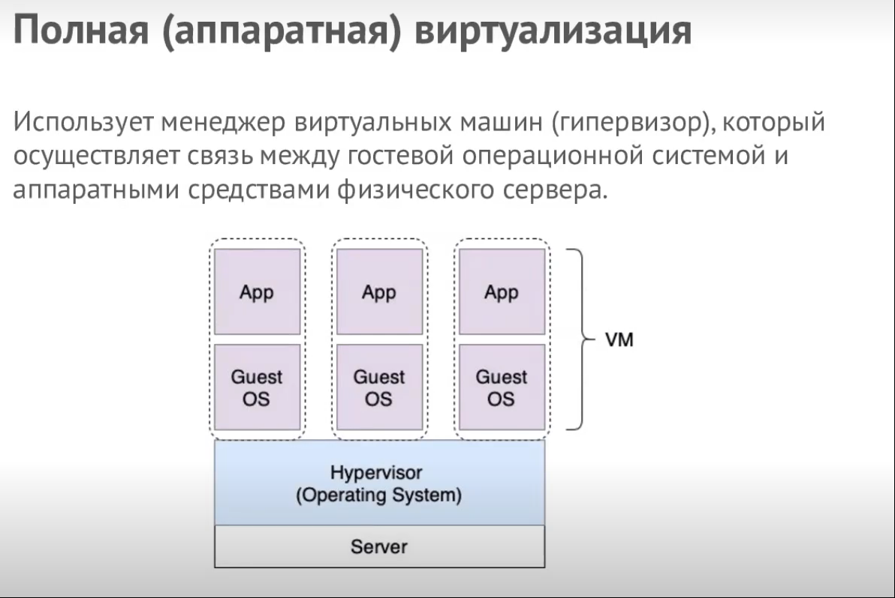
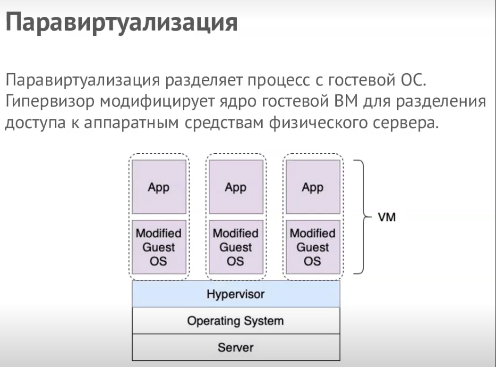

# virt-homeworks

# Домашнее задание к занятию "5.1. Основы виртуализации"

## Задача 1

Опишите кратко, как вы поняли: в чем основное отличие полной (аппаратной) виртуализации, паравиртуализации и виртуализации на основе ОС.

## Ответ 1:
Пожалуй, главное отличие паравиртуализации от виртуализации на основе ОС состоит в том, что при последней у нас созданные машины используют ядро родительской операционки, а значит это не позволяет создавать виртуалки с ядром отличным от ядра родителя. При паравиртуализации мы не используем ядро родителя напрямую, а значит можем создавать любые виртуалки без этой привязки. Полная виртуализация, в свою очередь, обладает таким преимуществом, что работает напрямую (на аппаратном уровне) и не требует установки доп прослоек в виде ОС на хост, т.к. сама ею является. Тем самым повышается быстродействие и уменьшается количество точек отказа.

## Доработка
**В чем разница при работе с ядром гостевой ОС для полной и паравиртуализации?**
Прямого ответа в лекции и в интернете не нашел (в интернете вообще у каждого свое понятие, поэтому зачастую одно и тоже решение мгут относить к разным типам виртуализации), поэтому делюсь своими мыслями исходя из почитанного / просмотренного материала..  

PS: Если я что-то опять не так понял, то прошу оставть контакт в дискорде/слаке/телеге для связи и консультации..

Насколько я понимаю, при полной виртуализации гипервизор и операционная система - одно целое, когда как при паравиртуализации нет (между гипервизором и физическим сервером есть еще один слой ОС). При паравиртуализации гипервизор модифицирует ядро гостевой ОС для доступа к железу физического сервера. При полной же виртуализации поддерживаются почти все гостевые операционные системы без изменений, что означает более хорошую совместимость по сравнению с паравиртуализации.
Вообще, если посмотреть на схемы, то при полной виртуализации процесс обращения приложения к физическим ресурсам идет через гостевую ОС => Гипервизор, а в  паравиртуализации - гостевую ОС => Гипервизор => OC

## Задача 2

Выберите один из вариантов использования организации физических серверов, в зависимости от условий использования.

Организация серверов:

    физические сервера,
    паравиртуализация,
    виртуализация уровня ОС.

Условия использования:

    Высоконагруженная база данных, чувствительная к отказу.
    Различные web-приложения.
    Windows системы для использования бухгалтерским отделом.
    Системы, выполняющие высокопроизводительные расчеты на GPU.

Опишите, почему вы выбрали к каждому целевому использованию такую организацию.

## Ответ 2:
**Высоконагруженная база данных, чувствительная к отказу** - физические сервера или полная (аппаратная виртуализация) типа VMware с нормальным бекап решением типа Veeam, поскольку при таком способе максимальное количество точек отказа минимально, а количество ресурсов доступных системе максимально.

**Различные web-приложения** - виртуализация уровня ОС. При таком способе приложение разрабатывается в изолированных контейнерах со всеми обвязками. Поэтому ускоряется возможность разворачивать приложения в проде, а также многократно упрощается возможность их маштабирования если нагрузка на этот сервис возрастет.

**Windows системы для использования Бухгалтерским отделом** - Паравиртуализация от Microsoft hyper-v в режиме службы в данном случае оптимально, поскольку это нативное и относительно решение для Windows от Windows же.

**Системы, выполняющие высокопроизводительные расчеты на GPU** - в зависимости от задач можно использовать разные стстемы. Физические сервера позволяют не терять ресурсы на виртуализации, с друго стороны паравиртуализация может позволить собрать несколько физических серверов в одно логическое и использовать эту абстракцию для управления всеми GPU сразу, например.

## Задача 3

Выберите подходящую систему управления виртуализацией для предложенного сценария. Детально опишите ваш выбор.

Сценарии:

1. 100 виртуальных машин на базе Linux и Windows, общие задачи, нет особых требований. Преимущественно Windows based инфраструктура, требуется реализация программных балансировщиков нагрузки, репликации данных и автоматизированного механизма создания резервных копий.
2. Требуется наиболее производительное бесплатное open source решение для виртуализации небольшой (20-30 серверов) инфраструктуры на базе Linux и Windows виртуальных машин.
3. Необходимо бесплатное, максимально совместимое и производительное решение для виртуализации Windows инфраструктуры.
4. Необходимо рабочее окружение для тестирования программного продукта на нескольких дистрибутивах Linux.

## Ответ 3:
1. Поскольку вопрос цены здесь не стоит, то мой выбор - VMware vSphere. Данный продукт поддерживает аппаратную виртуализацию, что водит к более высокому кпд и быстродействию, кластеризацию, что повышает отказоустойчивость, поддержку виртуализации как, Windows, так и Linux а также реализацию массового их создания, управления миграции бекапирования и т.д.

2. На мой взгляд лучшая система для реализации подобного проекта - паравиртуализация на основе Proxmox состоящая из 2-3 физических серверов, которые собираются в 2-3-одовый кластер.

3. Поскольку виртуализация только для Windows, то лучше всего использовать такой программный продукт, как Windows Hyper-V Server. По сравнению с двумя примерами выше обладает таким плюсом, как низкий порог вхождения и интуитивно понятный интерфейс.

4. Для реализации этой задачи лучше всего подходит виртуализация уровня OC в виде таких продуктов, как LXC, Docker, Podman. Основное преимущество подобных сред - выстрое развертывание неоходимых окружений для тестов, а также быстрое удаление уже ненужных компонентов без мусора в системе.

## Задача 4

Опишите возможные проблемы и недостатки гетерогенной среды виртуализации (использования нескольких систем управления виртуализацией одновременно) и что необходимо сделать для минимизации этих рисков и проблем. Если бы у вас был выбор, то создавали бы вы гетерогенную среду или нет? Мотивируйте ваш ответ примерами.

## Ответ 4:
Исходя из предыдущих заданий мы видим, что для различных задач и вводных есть разные механизмы их реализации. Вследствии этого, могут появляться различные системы управления виртуализацией. Отсюда может вытечь проблемма кадровая, поскольку на каждую подобную систему требуется специалист (а то и не один), который разбирается в этой конкретной технологии. Также бывает, что при слиянии компаний они использовали для одних и тех же задач разные системы. Объеденить бывает сложно или невозможно, поэтому "зоопарк" технологий растет..  
По возможности, нужно заранее продумать, с учетом на будущее, использование конкретного программного продукта.
Конечно, я бы не хотем использовать гетерогенную среду у себя на работе, поскольку это, усложняет управление инфраструктурой, а также подготовкой новых инженеров для ее управления. Хотя иногда бывает, что необходимы конкретные технологии в той или иной системе виртуализации, поэтому нужно также учитывать и задачи, которые стоят. Не все так однозначно, в общем..
